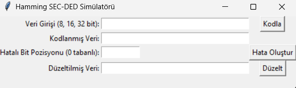

# Hamming SEC-DED Simülatörü

Bu proje, **Hamming SEC-DED (Single Error Correction, Double Error Detection)** algoritmasını kullanan bir simülatördür. 
Kullanıcılar 8, 16 veya 32 bitlik binary veri girerek:
- Veriyi Hamming kodu ile kodlayabilir,
- Kodlanmış veri üzerinde yapay hata oluşturabilir,
- Hataları tespit edip düzeltebilir.

## Özellikler

- Kodlama: Girilen binary veriyi Hamming(SEC-DED) formatında kodlar.
- Hata Oluşturma: Belirtilen bit pozisyonunda yapay hata ekler.
- Hata Tespit ve Düzeltme: Tek bit hatalarını düzeltir, çift bit hatalarını tespit eder.
- Tkinter GUI: Kullanıcı dostu grafik arayüzü oluşturur.

## Gereksinimler

- Python 3.x
- Tkinter (Python ile birlikte gelir)

## Kullanım

```bash
python hamming_simulator.py
```

Arayüzde sırasıyla:
1. **Veri Girişi:** 8, 16 veya 32 bitlik binary veri girin.
2. **Kodla:** Hamming SEC-DED kodlamasını gerçekleştirir.
3. **Hata Oluştur:** Kodlanmış veride belirli bir bit pozisyonunu ters çevirir.
4. **Düzelt:** Tek bit hatalarını otomatik düzeltir, çift bit hatalarını tespit eder.

## Örnek

1. Giriş: `10110011`
2. Kodla → `01100110101101` (örnek çıktı)
3. 5. bit için "Hata Oluştur"
4. Düzelt → `01100110101101`, 5. bit düzeltildi.

## 🖼️ Arayüzden Bir Görünüm



## 🎥 Demo Videosu

Aşağıdaki bağlantıdan projeyi çalışırken izleyebilirsiniz:  
[)

## Açıklama

- **SEC (Single Error Correction):** Tek bit hataları tespit edilir ve düzeltilir.
- **DED (Double Error Detection):** Çift bit hataları tespit edilir ancak düzeltilemez.
- Genel (overall) parite biti sayesinde çift bit hataları algılanabilir.

## Lisans

Bu proje eğitim amaçlıdır.
